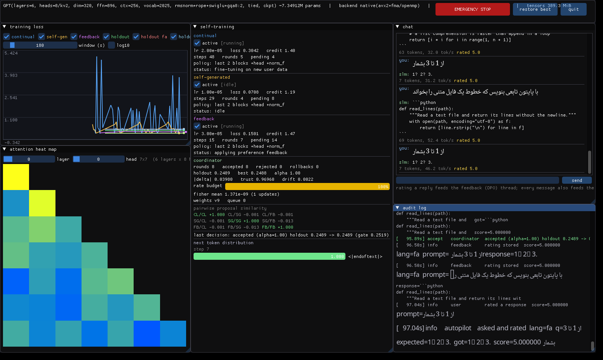

# slm — یک Small Language Model در C++ برای **فارسی، انگلیسی و پایتون**

یک ترنسفورمر decoder-only که کاملاً در C++17 نوشته شده، با پشتیبانی کامل فارسی
(از توکنایزر تا رندر RTL در GUI)، معماری امروزی (RMSNorm + RoPE + SwiGLU + GQA)،
و یک زیرسیستم خودآموزی سه‌گانه با coordinator که هر آپدیت را **جدا برای هر زبان**
اعتبارسنجی می‌کند.



* **موتور تنسور و autograd اختصاصی** (بدون هیچ وابستگی) + بکند اختیاری **libtorch**
  با همان API — ۳۱/۳۱ تست عددی گرادیان
* **فارسی درست، از پایه**: نیم‌فاصله، اعراب، حروف عربی/فارسی، شکل‌های نمایشی،
  ارقام، علائم نگارشی، bidi — همه نرمال‌سازی و تست شده (۴۲ تست)
* **رندر واقعی فارسی در GUI** با HarfBuzz + FreeType (حروف چسبان + RTL + fallback لاتین)
* **سه مکانیزم خودآموزی هم‌زمان** (یادگیری مداوم، داده‌ی خودتولید، بازخورد DPO) با
  **معیار کیفیت جدا برای هر زبان** و **گیت ضدفراموشی per-language**
* **ارزیابی چندزبانه**: loss/ppl/**bits-per-char** جدا برای هر زبان + سنجش تداخل زبانی
* بسته‌ی `.deb`، اسکریپت بیلد، و مدل آموزش‌دیده‌ی حاضر در مخزن

---

## نصب و اجرا

```bash
git clone https://github.com/Im-Saleh/My-LLM.git && cd My-LLM
sudo ./scripts/install_deps.sh          # کامپایلر، cmake، OpenGL/X11، freetype/harfbuzz، فونت فارسی
./build.sh --run-tests                  # → build/slm  (+ ۳۱ تست گرادیان + ۴۲ تست متن)
```

### مدل آماده (بدون آموزش)

```bash
build/slm chat --ckpt models/demo-tri.slm --tokenizer models/demo-tri.slmtok
```

```
you> پایتخت ژاپن کجاست؟
slm> پایتخت ژاپن شهر توکیو است.

you> عنکبوت چند پا دارد؟
slm> عنکبوت هشت پا دارد.

you> نیم‌فاصله چیست؟
slm> نیم‌فاصله فاصله‌ی مجازی است که دو بخش یک کلمه را جدا می‌کند بدون آنکه فاصله‌ی کامل بگذارد.

you> یک تابع پایتون بنویس که عدد فیبوناچی n-ام را حساب کند
slm> ```python
     def fib(n):
         """Return the n-th Fibonacci number iteratively."""
         a, b = 0, 1
         for _ in range(n):
             a, b = b, a + b
         return a
     ```
```

### همه‌ی مسیر، با یک اسکریپت

```bash
./scripts/quickstart.sh --config configs/slm-demo.conf --steps 1800 --gui
```

یا مرحله‌به‌مرحله:

```bash
python3 scripts/make_trilingual_data.py                 # data/{fa,en,py}.txt
MIX="fa=data/fa.txt:0.40,en=data/en.txt:0.25,py=data/py.txt:0.35"

build/slm tokenizer --mix "$MIX" --out run/tok.slmtok --vocab 6144
build/slm pretrain  --mix "$MIX" --tokenizer run/tok.slmtok --out run/base.slm \
                    --config configs/slm-demo.conf --steps 1800 --batch 8
build/slm eval      --mix "$MIX" --ckpt run/base.slm --tokenizer run/tok.slmtok
build/slm langcheck --mix "$MIX" --ckpt run/base.slm --tokenizer run/tok.slmtok
build/slm dashboard --mix "$MIX" --ckpt run/base.slm --tokenizer run/tok.slmtok \
                    --config configs/slm-demo.conf --autopilot
build/slm live      ...      # همان، با داشبورد ترمینالی (بدون نمایشگر)
```

### بسته‌ی `.deb`

```bash
./build.sh --deb                        # → dist/slm_0.2.0_amd64.deb
sudo apt install ./dist/slm_0.2.0_amd64.deb
```

بسته‌ی از پیش ساخته‌شده در `dist/` هست (نیاز به glibc ≥ ۲.۳۴ یعنی Ubuntu 22.04+).
`Depends` از خروجی `ldd` خود باینری ساخته می‌شود و اگر `dpkg-deb` نبود، بسته دستی
با `ar`+`tar` ساخته می‌شود.

### بکند libtorch (اختیاری، ~۴ برابر سریع‌تر روی CPU + CUDA)

```bash
wget https://download.pytorch.org/libtorch/cpu/libtorch-cxx11-abi-shared-with-deps-2.5.1%2Bcpu.zip
unzip libtorch-*.zip -d /opt && ./build.sh --libtorch /opt/libtorch --no-gui
```

هر دو بکند یک مدل و یک فایل `.slm` را می‌فهمند (تست‌شده: خروجی eval یکسان).

---

## مستندات

| سند | محتوا |
|---|---|
| [`docs/MULTILINGUAL.fa.md`](docs/MULTILINGUAL.fa.md) | **استراتژی توکنایزر، ترکیب دیتاست با درصد، پلن آموزش مرحله‌ای، ارزیابی** + منابع فارسی/کد |
| [`docs/COORDINATOR.fa.md`](docs/COORDINATOR.fa.md) | توضیح فنی دقیق coordinator و ترکیب سه منبع آپدیت |
| [`docs/ARCHITECTURE.fa.md`](docs/ARCHITECTURE.fa.md) | نمای کلی معماری، نمودار، همزمانی، بودجه‌ی حافظه |
| [`docs/SCALING.fa.md`](docs/SCALING.fa.md) | **۷ تریلیون پارامتر: اعداد واقعی** و نردبان اندازه‌های عملی |
| [`docs/STEP_BY_STEP.fa.md`](docs/STEP_BY_STEP.fa.md) | پیاده‌سازی گام‌به‌گام |

---

## نتایج اندازه‌گیری‌شده

مدل دمو: **۷.۳۵M پارامتر**، ۶ لایه، ۸ هد پرسش / ۲ هد KV، dim 320، ctx 256،
`rmsnorm+rope+swiglu+gqa8:2`، ۱۸۰۰ گام در ۱۴ دقیقه (libtorch CPU، ۸ هسته).

```
  source   lang        loss   perplexity  bits/char  chars/tok
  fa       fa        0.3275         1.39     0.0956       4.94
  en       en        0.3118         1.37     0.0903       4.98
  py       py        0.0713         1.07     0.0294       3.50
  ALL      -         0.2369         1.27          -          -

  lang    holdout      ppl  interfere   py-valid
  fa       0.3357     1.40       0.4%          -
  en       0.3151     1.37       0.0%          -
  py       0.0710     1.07       0.0%       100%
```

| مورد | نتیجه |
|---|---|
| تست گرادیان | **۳۱/۳۱** بومی، **۳۰/۳۰** libtorch (شامل RoPE/RMSNorm/SwiGLU/GQA و checkpointing) |
| تست متن/توکنایزر | **۴۲/۴۲** (UTF-8، نرمال‌سازی فارسی، pretokenize، تشخیص زبان، بررسی پایتون) |
| fertility فارسی | ۴.۹۵ کاراکتر بر توکن، سهم توکن تک‌بایتی ۱۴.۹٪ |
| GEMM بومی | ۶۱ GFLOP/s تک‌هسته، ۱۸۰ GFLOP/s روی ۸ هسته |
| آموزش | ۴۲۷۰ tok/s (libtorch CPU) / ~۱۸۰۰ tok/s (بومی) برای همین مدل |
| تولید با KV-cache | ۳۰–۸۵ tok/s روی CPU |
| checkpointing | فعال‌سازی ۴۳۲MiB → ۹۰MiB |
| کوانتیزاسیون | fp16 نصف (خطای RMS ۰.۰۱۸٪)، int8 گروهی ~۳.۹ برابر کوچک‌تر |
| کد از دستور فارسی | ۱۰۰٪ خروجی‌های پایتون از فیلتر ساختاری رد می‌شوند |

---

## فارسی: چه چیزی واقعاً حل شده

| لایه | کار انجام‌شده |
|---|---|
| نرمال‌سازی | ي→ی، ك→ک، ة→ه، أ/إ→ا، حذف اعراب و کشیده، ارقام فارسی/عربی→ASCII، تجزیه‌ی شکل‌های نمایشی (U+FE70..FEFF)، حذف نویسه‌های bidi، اصلاح فاصله‌های اطراف نیم‌فاصله |
| pretokenize | نیم‌فاصله **داخل** کلمه می‌ماند؛ «، ؛ ؟ « »» قطعه‌ی مستقل؛ دندانه‌گذاری پایتون یک قطعه؛ هر رقم یک توکن |
| سازگاری | پرچم نرمال‌سازی داخل فایل توکنایزر ذخیره می‌شود تا آموزش و inference هرگز ناهم‌خوان نشوند |
| ارزیابی | holdout و BPC جدا برای فارسی + سنجش نشت لاتین به فارسی |
| خودآموزی | فیلتر تداخل زبانی روی نمونه‌های خودتولید فارسی + گیت per-language در coordinator |
| GUI | shaping واقعی با HarfBuzz (حروف چسبان، لیگاتور لام‌الف، mark positioning) + bidi ساده + fallback فونت لاتین برای خطوط ترکیبی |
| ترمینال | داشبورد ANSI برای محیط‌هایی که فونت/نمایشگر ندارند |

اگر HarfBuzz/FreeType نصب نباشد، GUI بیلد و اجرا می‌شود اما فارسی را شکل نمی‌دهد
و پیام می‌دهد؛ داشبورد ترمینالی جایگزین کامل است.

---

## سیستم خودآموزی (خلاصه)

| ترد | داده | الگوریتم | محافظ چندزبانه |
|---|---|---|---|
| **الف) continual** | ورودی کاربر | fine-tune سبک، `lr` ۶۰× کمتر | replay **round-robin روی همه‌ی زبان‌ها** |
| **ب) self-gen** | تولید خود مدل | فیلتر کیفیت + آموزش | باند perplexity نسبی هر زبان، تداخل زبانی برای fa/en، بررسی ساختاری پایتون برای py، تازگی |
| **ج) feedback** | امتیاز ۱..۵ | **DPO** + جمله‌ی SFT | انتخاب جفت round-robin بین زبان‌ها + replay همه‌ی زبان‌ها با وزن ۰.۵ |

و coordinator که تنها نویسنده است:

```
Fisher damping (EWC) → trust-region هر منبع → تراش TIES → تصویرسازی PCGrad
→ انتخاب علامت + میانگین وزنی (اولویت × credit) → محدودکننده‌ی نرخ
→ line-search روی α∈{1,½,¼} با گیت holdout **برای هر زبان جدا** + سقف آنتروپی
→ پذیرش = swap اتمیک اشاره‌گر  |  رد = rollback خودکار
```

نمونه‌ی واقعی از `audit.jsonl`:

```json
{"level":"accept","source":"coordinator","message":"accepted (alpha=1.00) holdout 0.2489 -> 0.2489",
 "holdout_fa":"0.3357->0.3352","holdout_en":"0.3151->0.3149","holdout_py":"0.0710->0.0711"}
{"level":"filtered","source":"self-generated","message":"dropped: language interference (foreign letters 0.31)","lang":"fa"}
{"level":"filtered","source":"self-generated","message":"dropped: invalid python: unbalanced brackets","lang":"py"}
{"level":"propose","source":"feedback","message":"DPO: 3 preference pairs + 3 replay batches (w=0.50) [fa 2p/7r  en 1p/4r  py 0p/3r]"}
```

---

## دستورات CLI

```
slm info        [--config F]                            بودجه‌ی حافظه و بکند
slm plan        --params 7e12 [--experts N --topk N]     برنامه‌ریز حافظه/محاسبه
slm tokenizer   --out F [--vocab N] (--input F | --mix ...)   BPE + گزارش fertility
slm pretrain    --tokenizer F --out F (--data F | --mix ...)  آموزش با ترکیب وزن‌دار
slm chat        --ckpt F --tokenizer F [--prompt S]      تولید تعاملی (KV-cache)
slm eval        --ckpt F --tokenizer F --mix ...         loss/ppl/BPC هر زبان
slm langcheck   --ckpt F --tokenizer F --mix ...         تداخل زبانی + اعتبار کد
slm quantize    --in F --out F [--dtype q8|f16|f32]      تبدیل چک‌پوینت
slm bench       [--config F] [--batch N]                 توان عبوری
slm live        / slm dashboard                          سیستم کامل + داشبورد
slm_gradcheck   / slm_texttest                           تست‌ها
```

هر کلید کانفیگ از خط فرمان هم قابل تنظیم است: `--set coord.ties_keep=0.2`.

---

## معماری مدل

دو خانواده، با یک کد و انتخاب از طریق کانفیگ:

| legacy (GPT-2/nanoGPT) | modern (پیش‌فرض) |
|---|---|
| موقعیت یادگیرنده (جدول) | **RoPE** — سقف طول در وزن‌ها حک نمی‌شود |
| LayerNorm (gain+bias) | **RMSNorm** — ارزان‌تر و پایدارتر |
| MLP 4× با GELU | **SwiGLU** (gate × up، ~۸/۳ برابر) |
| multi-head attention | **GQA** (`n_kv_head`) — KV cache ۴ برابر کوچک‌تر |
| bias روی همه‌ی linear‌ها | بدون bias |

```
model.norm = rms|layer    model.pos = rope|learned    model.ffn = swiglu|gelu
model.n_kv_head = 2       model.rope_theta = 10000    model.linear_bias = false
```

---

## سخت‌افزار: ۱۶GB RAM / ۲GB VRAM

`slm plan --ram 16 --vram 2 --params <N>` برای هر اندازه‌ای عدد می‌دهد. خلاصه:

* **آموزش کامل** تا ~۱۵۰M پارامتر عملی است (روی ۲GB VRAM با bf16 + 8-bit optimiser
  + checkpointing؛ روی CPU محدودیت زمان است نه حافظه).
* **fine-tune جزئی** (دو بلوک آخر + head) یک مدل ~۱–۳B را روی ۲GB VRAM ممکن می‌کند —
  همان حالتی که سه ترد خودآموزی در آن کار می‌کنند.
* **inference int8** تا ~۱.۸B روی ۲GB VRAM و تا ~۱۶B روی ۱۶GB RAM.
* **۷ تریلیون پارامتر**: ~۳۸TB حالت آموزش و ~۴۹۰ کارت ۸۰گیگی — روی این سخت‌افزار
  ممکن نیست. جزئیات و نردبان کامل: [`docs/SCALING.fa.md`](docs/SCALING.fa.md).

---

## ساختار پروژه

```
src/
  core/tensor.h            façade مشترک هر دو بکند
  core/tensor_native.cpp   autograd بومی + RoPE/RMSNorm/SwiGLU/GQA + checkpointing
  core/tensor_torch.cpp    بکند libtorch (همان façade)
  core/gemm.{h,cpp}        SGEMM با AVX2/FMA + OpenMP و انتخاب در زمان اجرا
  core/text.{h,cpp}        UTF-8، نرمال‌سازی فارسی، تشخیص زبان، بررسی پایتون
  core/dataset.{h,cpp}     TokenDataset + MixtureDataset (وزن‌دار، holdout هر زبان)
  core/{optim,serialize,params,config,rng}.*
  model.{h,cpp}            ترنسفورمر (دو خانواده‌ی معماری)، freeze، KV-cache
  tokenizer.{h,cpp}        BPE بایت‌محور + نرمال‌سازی + fertility
  coordinator.{h,cpp}      ادغام و گیت per-language  ← هسته‌ی پروژه
  trainer.{h,cpp} train_continual.* train_selfgen.* train_feedback.*
  telemetry.* chat.* app.* main.cpp
  gui.cpp gui_text.{h,cpp} gui_terminal.cpp    داشبورد + shaping فارسی
  tests/gradcheck.cpp tests/text_test.cpp
configs/  slm-tiny | slm-demo | slm-124m
scripts/  install_deps | make_trilingual_data | make_sample_data | fetch_data | quickstart | make_deb
models/   demo-tri.slm (fp16، آموزش‌دیده) + demo-tri.slmtok
```

## محدودیت‌های شناخته‌شده

* کورپوس نمونه **مصنوعی و قالبی** است (برای اینکه مخزن بدون متن ثالث بماند و
  ارزیابی خودکار ممکن باشد). برای مدل واقعی منابع بخش ۲ سند MULTILINGUAL را بگیر.
  به همین دلیل vocab روی ~۲k اشباع می‌شود و مدل ۷M در حساب ضعیف است.
* **MoE و شاردینگ چند-دستگاهی پیاده نشده‌اند** (در `slm plan` مدل‌سازی شده‌اند).
* int8 فعلاً فقط در لایه‌ی ذخیره‌سازی است، ضرب ماتریسی int8 نه.
* GPU فقط با بکند libtorch.
* ImGui خودش RTL نمی‌فهمد؛ متن فارسی از مسیر HarfBuzz رندر می‌شود، اما
  ویجت ورودی متن هنوز فارسی را شکل نمی‌دهد (پیش‌نمایش شکل‌دهی‌شده زیر آن نشان داده می‌شود).

## مجوز

Apache License 2.0 — فایل [`LICENSE`](LICENSE).
