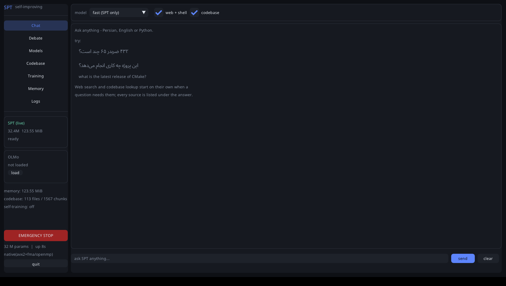

# slm — یک Small Language Model در C++ برای **فارسی، انگلیسی و پایتون**

یک ترنسفورمر decoder-only که کاملاً در C++17 نوشته شده، با پشتیبانی کامل فارسی
(از توکنایزر تا رندر RTL در GUI)، معماری امروزی (RMSNorm + RoPE + SwiGLU + GQA)،
و یک زیرسیستم خودآموزی سه‌گانه با coordinator که هر آپدیت را **جدا برای هر زبان**
اعتبارسنجی می‌کند.


* **موتور تنسور و autograd اختصاصی** (بدون هیچ وابستگی) + بکند اختیاری **libtorch**
  با همان API — ۳۱/۳۱ تست عددی گرادیان
* **فارسی درست، از پایه**: نیم‌فاصله، اعراب، حروف عربی/فارسی، شکل‌های نمایشی،
  ارقام، علائم نگارشی، bidi — همه نرمال‌سازی و تست شده (۴۲ تست)
* **رندر واقعی فارسی در GUI** با HarfBuzz + FreeType (حروف چسبان + RTL + fallback لاتین)
* **سه مکانیزم خودآموزی هم‌زمان** (یادگیری مداوم، داده‌ی خودتولید، بازخورد DPO) با
  **معیار کیفیت جدا برای هر زبان** و **گیت ضدفراموشی per-language**
* **ارزیابی چندزبانه**: loss/ppl/**bits-per-char** جدا برای هر زبان + سنجش تداخل زبانی
* بسته‌ی `.deb`، اسکریپت بیلد، و مدل آموزش‌دیده‌ی حاضر در مخزن

---

## شروع سریع: یک کامند

```bash
git clone https://github.com/Im-Saleh/My-LLM && cd My-LLM
./install.sh --deps --with-olmo      # نصب کامل: هر دو مدل + لانچر دسکتاپ
slm                                  # همین. داشبورد باز می‌شود.
```

> **اگر قبلاً نصب کرده‌اید و خطای `libllama.so: cannot open shared object file`
> گرفتید**: باگ لینک بود و اصلاح شد. یک بار با پوشه‌ی build تازه نصب کنید:
> `rm -rf build && ./update.sh`  (توضیح کامل: [`docs/TRAINING.fa.md`](docs/TRAINING.fa.md) بخش ۸)

`install.sh` وابستگی‌ها را نصب می‌کند، با GUI و llama.cpp بیلد می‌گیرد، باینری و
**مدل SPT** را در `/usr/local` می‌گذارد، یک لانچر دسکتاپ می‌سازد، و با `--with-olmo`
مدل آماده‌ی **OLMo 3 7B** را هم دانلود می‌کند. بدون root:
`./install.sh --prefix ~/.local`. بدون OLMo هم کار می‌کند و بعداً
`slm fetch-model olmo` اضافه‌اش می‌کند.

### دو مدل

| | SPT | OLMo |
|---|---|---|
| چیست | **مدل شما** — ۳۲.۴M پارامتر | **مدل آماده** — OLMo 3 7B Instruct |
| حجم | ۱۸ MB (int4) | ۴.۵ GB (Q4_K_M) |
| سرعت | ۴۴۸ tok/s | چند tok/s روی CPU |
| آموزش | آموزش‌دیده + قابل ادامه + خودآموز | بدون آموزش |
| نصب | همراه پروژه | `slm fetch-model olmo` |

در بخش **Chat** از منوی بالا انتخاب می‌کنید: `fast (SPT)`، `strong (OLMo)`،
`debate (both)` یا `self-debate`. همه‌ی امکانات agent در همان chat فعال است:
جست‌وجوی وب، خواندن صفحه، خواندن پوشه/کدبیس، و shell با تأیید شما.



### خودآموزی به‌طور پیش‌فرض خاموش است

سه thread خودآموزی تا وقتی در تب **Training** سوئیچ را روشن نکنید کار نمی‌کنند
(یا `--set train.enabled=true`). مدلی که به‌محض باز شدن داشبورد وزن‌های خودش را
بازنویسی کند، چیزی نیست که کسی از یک بسته‌ی نصبی انتظار دارد.

`slm up` هیچ آرگومانی لازم ندارد: مدل `spt` را در `./models`، `~/.local/share/slm`،
`/usr/share/slm/models` و کنار خود باینری می‌گردد، و اگر پیدا نکرد **خودش یک مدل
شروع می‌سازد** تا داشبورد همیشه باز شود. با `slm up --where` می‌بینید کجاها را گشته.
اگر display نباشد خودکار به داشبورد ترمینال برمی‌گردد.

یک مدل وجود دارد و اسمش **SPT** است: `models/spt.slm` + `models/spt.slmtok`
(+ `models/spt-q4.slmq` برای اجرای int4).

### عامل دو-مدلی و مناظره

```bash
# فقط SPT (سریع)
slm agent --ask "..."

# با OLMo 3 7B هم:
slm agent --gguf ~/models/Olmo-3-7B-Instruct-Q4_K_M.gguf --mode debate \
          --fast-mult 2 --strong-mult 1 --ask "..." --transcript

# مناظره‌ی یک مدل با خودش (چند صدا، KV cache و persona جدا)
slm agent --mode self --voices 3 --ask "..."

# ایندکس کدبیس و پرسش درباره‌اش
slm agent --index . --ask "کجای کد تصمیم می‌گیرد آپدیت پذیرفته شود؟"
slm agent --index . --symbol qpack_synthesise      # فقط بازیابی، بدون مدل
```

جزئیات: [`docs/AGENT.fa.md`](docs/AGENT.fa.md)

## نصب و اجرا

```bash
git clone https://github.com/Im-Saleh/My-LLM.git && cd My-LLM
sudo ./scripts/install_deps.sh          # کامپایلر، cmake، OpenGL/X11، freetype/harfbuzz، فونت فارسی
./build.sh --run-tests                  # → build/slm  (+ ۳۱ تست گرادیان + ۴۲ تست متن)
```

### مدل‌های آماده (بدون آموزش)

سه چک‌پوینت در مخزن هست، هر کدام برای یک کار:

| مدل | پارامتر | آموزش | برای چه خوب است |
|---|---|---|---|
| `models/demo-fa-base.slm` | **۱۳.۹۹M** | ۱۴.۷M توکن **داده‌ی واقعی** (ویکی‌پدیای فارسی + پایتون + انگلیسی) | ادامه‌دادن متن فارسی واقعی — **۱.۸۷ bits/char** روی holdout ویکی‌پدیا |
| `models/demo-fa.slm` | **۱۳.۹۹M** | همان + ۳.۴M توکن SFT دستوری | پاسخ‌دهی به سبک چت (ppl ۲.۴۷ روی داده‌ی دستوری) |
| `models/demo-tri.slm` | ۷.۳۵M | ۳.۷M توکن کورپوس قالبی | دموی پرسش‌وپاسخ دقیق روی همان قالب‌ها |

```bash
# چت با مدل دستوری
build/slm chat --ckpt models/demo-fa.slm --tokenizer models/demo-fa.slmtok

# ادامه‌ی متن فارسی با مدل پایه
build/slm chat --ckpt models/demo-fa-base.slm --tokenizer models/demo-fa.slmtok \
               --prompt "ایران کشوری در" --max-new 60 --temp 0.7
# → « سال 1398 به عنوان یکی از آثار ملی ایران، ... جستارهای وابسته،
#     فهرست شهرهای ...، سازمان میراث فرهنگی، صنایع دستی و گردشگری»

# چت با حافظه‌ی بلندمدت
build/slm memory --file runs/memory.jsonl add "اسم من صالح است و پایتون کار می‌کنم"
build/slm chat --ckpt models/demo-fa.slm --tokenizer models/demo-fa.slmtok \
               --memory runs/memory.jsonl
```

```
you> پایتخت ژاپن کجاست؟
slm> پایتخت ژاپن شهر توکیو است.

you> عنکبوت چند پا دارد؟
slm> عنکبوت هشت پا دارد.

you> نیم‌فاصله چیست؟
slm> نیم‌فاصله فاصله‌ی مجازی است که دو بخش یک کلمه را جدا می‌کند بدون آنکه فاصله‌ی کامل بگذارد.

you> یک تابع پایتون بنویس که عدد فیبوناچی n-ام را حساب کند
slm> ```python
     def fib(n):
         """Return the n-th Fibonacci number iteratively."""
         a, b = 0, 1
         for _ in range(n):
             a, b = b, a + b
         return a
     ```
```

### داده‌ی واقعی + آموزش مرحله‌ای، با دو اسکریپت

```bash
# ۱) دانلود + تمیزکاری + dedup + توکنایزر + توکنایز به فایل mmap
./scripts/update_data.sh --budget-mb 1000 --share "fa=0.55,en=0.15,py=0.30"

# ۲) سه مرحله‌ی آموزش (پیش‌آموزش → anneal کد → SFT دستوری)
./scripts/train_stages.sh --steps 4000
LIBTORCH=/opt/libtorch ./scripts/train_stages.sh --steps 4000   # ۴ برابر سریع‌تر
```

`update_data.sh` واقعاً دانلود می‌کند (ویکی‌پدیای فارسی، `codeparrot-clean`،
ویکی‌پدیای انگلیسی) و علاوه بر آن **داده‌ی پل** را از docstringهای واقعی کد
استخراج می‌کند. خروجی این اجرا در همین مخزن:

```
  fa     725 MB  ->  135.8M توکن        (ویکی‌پدیای فارسی، dedup شده)
  py     207 MB  ->   69.7M توکن        (codeparrot-clean، فیلتر AST)
  en     110 MB  ->   37.5M توکن
  bridge  22 MB  ->    7.0M توکن        (جفت‌های docstring → کد، استخراج‌شده)
  ------------------------------------------------------------------
  total 1.02 GB  ->  250.0M توکن  در ۱۲.۶ ثانیه (۱۰۰ MB/s، ۸ رشته)
                     ۴۷۷MB روی دیسک به‌صورت uint16، mmap بدون مصرف RAM
```

یا مرحله‌به‌مرحله:

```bash
python3 scripts/make_trilingual_data.py                 # data/{fa,en,py}.txt
MIX="fa=data/fa.txt:0.40,en=data/en.txt:0.25,py=data/py.txt:0.35"

build/slm tokenizer --mix "$MIX" --out run/tok.slmtok --vocab 6144
build/slm pretrain  --mix "$MIX" --tokenizer run/tok.slmtok --out run/base.slm \
                    --config configs/slm-demo.conf --steps 1800 --batch 8
build/slm eval      --mix "$MIX" --ckpt run/base.slm --tokenizer run/tok.slmtok
build/slm langcheck --mix "$MIX" --ckpt run/base.slm --tokenizer run/tok.slmtok
build/slm dashboard --mix "$MIX" --ckpt run/base.slm --tokenizer run/tok.slmtok \
                    --config configs/slm-demo.conf --autopilot
build/slm live      ...      # همان، با داشبورد ترمینالی (بدون نمایشگر)
```

### بسته‌ی `.deb`

```bash
./build.sh --deb                        # → dist/slm_0.2.0_amd64.deb
sudo apt install ./dist/slm_0.2.0_amd64.deb
```

بسته‌ی از پیش ساخته‌شده در `dist/` هست (نیاز به glibc ≥ ۲.۳۴ یعنی Ubuntu 22.04+).
`Depends` از خروجی `ldd` خود باینری ساخته می‌شود و اگر `dpkg-deb` نبود، بسته دستی
با `ar`+`tar` ساخته می‌شود.

### بکند libtorch (اختیاری، ~۴ برابر سریع‌تر روی CPU + CUDA)

```bash
wget https://download.pytorch.org/libtorch/cpu/libtorch-cxx11-abi-shared-with-deps-2.5.1%2Bcpu.zip
unzip libtorch-*.zip -d /opt && ./build.sh --libtorch /opt/libtorch --no-gui
```

هر دو بکند یک مدل و یک فایل `.slm` را می‌فهمند (تست‌شده: خروجی eval یکسان).

---

## مستندات

| سند | محتوا |
|---|---|
| [`docs/MULTILINGUAL.fa.md`](docs/MULTILINGUAL.fa.md) | **استراتژی توکنایزر، ترکیب دیتاست با درصد، پلن آموزش مرحله‌ای، ارزیابی** + منابع فارسی/کد |
| [`docs/COORDINATOR.fa.md`](docs/COORDINATOR.fa.md) | توضیح فنی دقیق coordinator و ترکیب سه منبع آپدیت |
| [`docs/ARCHITECTURE.fa.md`](docs/ARCHITECTURE.fa.md) | نمای کلی معماری، نمودار، همزمانی، بودجه‌ی حافظه |
| [`docs/TRAINING.fa.md`](docs/TRAINING.fa.md) | **گزارش آموزش SPT-30M**: داده، اعداد، و آنچه یاد نگرفت |
| [`docs/AGENT.fa.md`](docs/AGENT.fa.md) | **عامل دو-مدلی، مناظره‌ی وزن‌دار، ابزارها و RAG کدبیس** |
| [`docs/QUANTIZATION.fa.md`](docs/QUANTIZATION.fa.md) | **int4/int8 + mmap: اجرای مدل ۲ میلیارد پارامتری** روی همین سخت‌افزار |
| [`docs/SCALING.fa.md`](docs/SCALING.fa.md) | **۷ تریلیون پارامتر: اعداد واقعی** و نردبان اندازه‌های عملی |
| [`docs/TEACHING.fa.md`](docs/TEACHING.fa.md) | **چطور به مدل چیز یاد بدهم** — چهار سطح یادگیری، از حافظه تا fine-tune |
| [`docs/STEP_BY_STEP.fa.md`](docs/STEP_BY_STEP.fa.md) | پیاده‌سازی گام‌به‌گام |

---

## نتایج اندازه‌گیری‌شده

مدل اصلی: **۱۳,۹۹۰,۱۷۶ پارامتر** (۱۳.۹۹M)، ۷ لایه (از ۶ **رشد کرده**), ۸ هد پرسش /
۲ هد KV، dim 384، ffn 1024، ctx 512، vocab 8192،
`qknorm+rmsnorm+rope+swiglu+gqa8:2`، **۱۷.۹M توکن داده‌ی واقعی** در ۱۰۵ دقیقه
(libtorch CPU، ۸ هسته، ۲۶۰۰–۳۷۰۰ توکن بر ثانیه).

```
  source   lang        loss   perplexity  bits/char       (مدل پایه، داده‌ی واقعی)
  fa       fa        3.8454        46.78     1.8727
  py       py        3.9496        51.91     1.9281
  en       en        5.1296       168.95     2.5243
```

رشد تدریجی پارامترها در حین آموزش، از لاگ واقعی:

```
>>> GROWTH at step 600: 6 -> 7 layers, 12.441M -> 13.990M parameters (+12.5%)
step   600 | loss 5.6823 | lr 6.82e-05 | 4.92M tok | 13.990M par
        >> holdout 5.4803 *best  |  fa 5.6894  en 6.0723  py 5.1768
```

مدل قبلی (کورپوس قالبی): ۷.۳۵M پارامتر، ۳.۷M توکن.

```
  source   lang        loss   perplexity  bits/char  chars/tok
  fa       fa        0.3275         1.39     0.0956       4.94
  en       en        0.3118         1.37     0.0903       4.98
  py       py        0.0713         1.07     0.0294       3.50
  ALL      -         0.2369         1.27          -          -

  lang    holdout      ppl  interfere   py-valid
  fa       0.3357     1.40       0.4%          -
  en       0.3151     1.37       0.0%          -
  py       0.0710     1.07       0.0%       100%
```

| مورد | نتیجه |
|---|---|
| تست گرادیان | **۳۲/۳۲** بومی (شامل RoPE/RMSNorm/SwiGLU/GQA/z-loss و checkpointing) |
| تست متن/توکنایزر | **۴۲/۴۲** (UTF-8، نرمال‌سازی فارسی، pretokenize، تشخیص زبان، بررسی پایتون) |
| fertility فارسی (داده‌ی واقعی) | ۲.۹۶ کاراکتر بر توکن، سهم توکن تک‌بایتی **۵.۶٪** |
| توکنایز کردن | ۱۰۰ MB/s موازی → ۲۵۰M توکن در ۱۲.۶ ثانیه، mmap با صفر RAM |
| GEMM بومی | ۶۱ GFLOP/s تک‌هسته، ۱۸۰ GFLOP/s روی ۸ هسته |
| آموزش | ۴۲۷۰ tok/s (libtorch CPU) / ~۱۸۰۰ tok/s (بومی) برای همین مدل |
| تولید با KV-cache | ۳۰–۸۵ tok/s روی CPU |
| checkpointing | فعال‌سازی ۴۳۲MiB → ۹۰MiB |
| کوانتیزاسیون ذخیره‌سازی | fp16 نصف (خطای RMS ۰.۰۱۸٪)، int8 گروهی ~۳.۹ برابر کوچک‌تر |
| **استقرار int4 (`.slmq`)** | همین مدل ۷.۲MB (۷.۵ برابر کوچک‌تر) با **+۰.۱۵٪ perplexity** |
| **مدل ۱.۹۳B پارامتری** | ۹۹۰MiB فایل، **۲۶–۲۹ tok/s** روی ۸ هسته، ~۱GB RSS |
| تست کوانتیزاسیون | **۳۳/۳۳** (کرنل‌های صحیح، ظرف mmap، تطابق سرتاسری با مسیر f32) |
| کد از دستور فارسی | ۱۰۰٪ خروجی‌های پایتون از فیلتر ساختاری رد می‌شوند |

---

## استقرار: int4 + mmap (اجرای ۲ میلیارد پارامتر)

مسیر آموزش با float32 و autograd کار می‌کند؛ مسیر **اجرا** یک موتور جداگانه دارد که
وزن‌ها را از یک فایل `.slmq` **memory-map** می‌کند و ضرب‌ها را با دستورات **صحیح**
(`vpmaddubsw`/`vpmaddwd`) می‌زند — الگوی PicoLM/llama.cpp. هیچ وزن شناوری ساخته نمی‌شود.

```bash
./build/slm pack  --in models/demo-fa.slm --out fa-q4.slmq --bits 4
./build/slm qrun  --model fa-q4.slmq --tokenizer models/demo-fa.slmtok \
                  --prompt "ایران کشوری است که" --max-new 60
./build/slm qeval --model fa-q4.slmq --tokenizer models/demo-fa.slmtok \
                  --data data/fa.txt --tail --ckpt models/demo-fa.slm   # هزینه‌ی دقیق کوانتیزاسیون
```

روی همان مدل فارسی ۱۳.۹۹M و همان توکن‌ها:

| فرمت | حجم | بیت بر وزن | perplexity | هزینه |
|---|---|---|---|---|
| f32 | ۵۴ MB | ۳۲.۰۰ | ۱۵۹.۶۴ | — |
| f16 | ۲۷ MB | ۱۶.۰۱ | ۱۵۹.۶۴ | ۰.۰۰٪ |
| q8 | ۱۴ MB | ۸.۲۶ | ۱۵۹.۶۹ | +۰.۰۳٪ |
| **q4** | **۷.۲ MB** | **۴.۲۶** | ۱۶۳.۲۴ | **+۲.۳٪** |

decode یک عملیات **memory-bound** است، پس بایت کم‌تر یعنی سرعت بیش‌تر. مدل ۱۴M در کش
CPU جا می‌شود و تفاوتی نشان نمی‌دهد، ولی از جایی که مدل از کش بیرون بزند:

| مدل ۶۱۶M | حجم | decode | prefill |
|---|---|---|---|
| f16 | ۱.۱۵ GiB | ۳۲.۲ tok/s | ۵۸ tok/s |
| **q4** | ۳۱۳ MiB | **۷۷.۲ tok/s** | **۱۵۰ tok/s** |

و مدل بزرگ، ساخته‌شده **بدون** اینکه هیچ‌وقت نسخه‌ی f32 آن (۷.۲GiB) وجود داشته باشد:

```bash
./build/slm pack --synth --dim 2560 --layers 28 --heads 20 --kv-heads 4 \
                 --vocab 8192 --ctx 2048 --bits 4 --out big-2b-q4.slmq
./build/slm qbench --model big-2b-q4.slmq --prompt-len 32 --gen 8 --cold
```

```
QModel(28L x 2560d, vocab 8192, ctx 2048, qknorm+rmsnorm+rope+swiglu+gqa20:4)
  1934.12M params, q4, 4.296 bits/weight, 990.42 MiB file
  اوج RAM هنگام ساخت: 5.1 MB      (نسخه‌ی f32 همین مدل: 7.21 GiB)
  decode: 26–29 tok/s (35–39 ms/token)، پهنای باند مؤثر ~۲۷–۳۰ GB/s، RSS ~۱.۰GB
  اولین توکن سرد: ۶.۹ ثانیه (۹۹۰MB از دیسک)، KV cache در ctx=2048: ۱۱۷MB
```

جزئیات کامل (چیدمان گروه‌های ۶۴تایی، تصحیح `−8·Σa`، کنترل سرریز int16، جست‌وجوی
مقیاس، فرمت ظرف): [`docs/QUANTIZATION.fa.md`](docs/QUANTIZATION.fa.md).

---

## فارسی: چه چیزی واقعاً حل شده

| لایه | کار انجام‌شده |
|---|---|
| نرمال‌سازی | ي→ی، ك→ک، ة→ه، أ/إ→ا، حذف اعراب و کشیده، ارقام فارسی/عربی→ASCII، تجزیه‌ی شکل‌های نمایشی (U+FE70..FEFF)، حذف نویسه‌های bidi، اصلاح فاصله‌های اطراف نیم‌فاصله |
| pretokenize | نیم‌فاصله **داخل** کلمه می‌ماند؛ «، ؛ ؟ « »» قطعه‌ی مستقل؛ دندانه‌گذاری پایتون یک قطعه؛ هر رقم یک توکن |
| سازگاری | پرچم نرمال‌سازی داخل فایل توکنایزر ذخیره می‌شود تا آموزش و inference هرگز ناهم‌خوان نشوند |
| ارزیابی | holdout و BPC جدا برای فارسی + سنجش نشت لاتین به فارسی |
| خودآموزی | فیلتر تداخل زبانی روی نمونه‌های خودتولید فارسی + گیت per-language در coordinator |
| GUI | shaping واقعی با HarfBuzz (حروف چسبان، لیگاتور لام‌الف، mark positioning) + bidi ساده + fallback فونت لاتین برای خطوط ترکیبی |
| ترمینال | داشبورد ANSI برای محیط‌هایی که فونت/نمایشگر ندارند |

اگر HarfBuzz/FreeType نصب نباشد، GUI بیلد و اجرا می‌شود اما فارسی را شکل نمی‌دهد
و پیام می‌دهد؛ داشبورد ترمینالی جایگزین کامل است.

---

## حافظه‌ی بلندمدت

سه سطح حافظه، جدا و مکمل هم:

```bash
slm memory --file runs/memory.jsonl add "پروژه‌ی من با C++ نوشته شده" --importance 2
slm memory --file runs/memory.jsonl search "زبان پروژه من چیست؟"
#   0.365  #1  [user] اسم من صالح است و به پایتون علاقه دارم
slm chat --ckpt models/demo-fa.slm --tokenizer models/demo-fa.slmtok --memory runs/memory.jsonl
```

| سطح | مکانیزم | سرعت | ماندگاری |
|---|---|---|---|
| زمینه | پرامپت | فوری | همان گفت‌وگو |
| **بازیابی** | `MemoryStore`: سه‌گرام کاراکتری هش‌شده + کسینوس، تزریق به‌صورت بلوک `<|system|>` | فوری | فایل JSONL |
| **وزن‌ها** | دکمه‌ی «teach the weights» → ترد یادگیری مداوم | ثانیه‌ها | دائمی در پارامترها |

بازیابی عمداً **مدل‌مستقل** است (بدون forward pass، زبان‌مستقل، قطعی) تا وقتی
مدل زیر خودآموزی تغییر می‌کند هم قابل‌اعتماد بماند. در داشبورد پنل مخصوص دارد و
در ترمینال با `m <متن>` می‌نویسی و با `t` به وزن‌ها منتقل می‌کنی.

## رشد تدریجی پارامترها

مدل می‌تواند **در حین آموزش بزرگ شود**: بلوک بالایی تکرار و وزن‌های خروجی
باقی‌مانده‌اش صفر می‌شوند، پس بلوک جدید دقیقاً همانی است و loss جهش نمی‌کند
(Net2Net / progressive stacking). گام‌های اول روی مدل کوچک و ارزان اجرا می‌شوند و
تعداد پارامتر در لاگ و در داشبورد زنده دیده می‌شود.

```bash
slm pretrain ... --grow "600:1,1200:1"     # +۱ لایه در گام ۶۰۰ و ۱۲۰۰
```

## الگوریتم‌های پایداری آموزش (از OLMo/PaLM)

| تکنیک | چه می‌کند | کلید |
|---|---|---|
| **QK-norm** | RMSNorm روی q و k قبل از RoPE؛ لاجیت‌های توجه بی‌کران رشد نمی‌کنند (کلید پایداری OLMo 2) | `model.qk_norm` |
| **z-loss** | جریمه‌ی `logsumexp²` تا تابع پارتیشن softmax نزدیک ۱ بماند (PaLM/OLMo) | `train.zloss` |
| **WSD schedule** | warmup → فلات → افت ۱-√t؛ هر چک‌پوینت روی فلات نقطه‌ی شروع معتبری است (برخلاف cosine) | `train.schedule=wsd` |
| **spike skip** | بچی که نُرم گرادیانش ۴ برابر EMA است **اعمال نمی‌شود** | `train.skip_spike` |
| **resume امن** | معماری از چک‌پوینت خوانده می‌شود نه از کانفیگ (وگرنه لایه‌های رشدیافته دور ریخته می‌شوند) | `--resume` |

## سیستم خودآموزی (خلاصه)

| ترد | داده | الگوریتم | محافظ چندزبانه |
|---|---|---|---|
| **الف) continual** | ورودی کاربر | fine-tune سبک، `lr` ۶۰× کمتر | replay **round-robin روی همه‌ی زبان‌ها** |
| **ب) self-gen** | تولید خود مدل | فیلتر کیفیت + آموزش | باند perplexity نسبی هر زبان، تداخل زبانی برای fa/en، بررسی ساختاری پایتون برای py، تازگی |
| **ج) feedback** | امتیاز ۱..۵ | **DPO** + جمله‌ی SFT | انتخاب جفت round-robin بین زبان‌ها + replay همه‌ی زبان‌ها با وزن ۰.۵ |

و coordinator که تنها نویسنده است:

```
Fisher damping (EWC) → trust-region هر منبع → تراش TIES → تصویرسازی PCGrad
→ انتخاب علامت + میانگین وزنی (اولویت × credit) → محدودکننده‌ی نرخ
→ line-search روی α∈{1,½,¼} با گیت holdout **برای هر زبان جدا** + سقف آنتروپی
→ پذیرش = swap اتمیک اشاره‌گر  |  رد = rollback خودکار
```

نمونه‌ی واقعی از `audit.jsonl`:

```json
{"level":"accept","source":"coordinator","message":"accepted (alpha=1.00) holdout 0.2489 -> 0.2489",
 "holdout_fa":"0.3357->0.3352","holdout_en":"0.3151->0.3149","holdout_py":"0.0710->0.0711"}
{"level":"filtered","source":"self-generated","message":"dropped: language interference (foreign letters 0.31)","lang":"fa"}
{"level":"filtered","source":"self-generated","message":"dropped: invalid python: unbalanced brackets","lang":"py"}
{"level":"propose","source":"feedback","message":"DPO: 3 preference pairs + 3 replay batches (w=0.50) [fa 2p/7r  en 1p/4r  py 0p/3r]"}
```

---

## دستورات CLI

```
slm info        [--config F]                            بودجه‌ی حافظه و بکند
slm plan        --params 7e12 [--experts N --topk N]     برنامه‌ریز حافظه/محاسبه
slm tokenizer   --out F [--vocab N] (--input F | --mix ...)   BPE + گزارش fertility
slm tokenize    --tokenizer F --in fa=F,py=F [--out-dir D]   BPE موازی → باینری mmap
slm memory      [--file F] add|list|search|context|forget    حافظه‌ی بلندمدت
slm pretrain    --tokenizer F --out F (--data F | --mix ...)  آموزش با ترکیب وزن‌دار
slm chat        --ckpt F --tokenizer F [--prompt S]      تولید تعاملی (KV-cache)
slm eval        --ckpt F --tokenizer F --mix ...         loss/ppl/BPC هر زبان
slm langcheck   --ckpt F --tokenizer F --mix ...         تداخل زبانی + اعتبار کد
slm quantize    --in F --out F [--dtype q8|f16|f32]      تبدیل چک‌پوینت
slm pack        --in F.slm --out F.slmq [--bits 4|8]     ساخت فایل mmap شدنی int4/int8
slm pack        --synth --dim N --layers N --bits 4      ساخت مستقیم مدل بزرگ روی دیسک
slm qrun        --model F.slmq --tokenizer F [--prompt S]  اجرا با کرنل صحیح (بدون وزن شناور)
slm qbench      --model F.slmq [--gen N] [--cold]        توان عبوری + حافظه‌ی واقعی
slm qeval       --model F.slmq --data F [--ckpt F.slm]   کیفیت کوانتیزه در برابر f32
slm bench       [--config F] [--batch N]                 توان عبوری
slm live        / slm dashboard                          سیستم کامل + داشبورد
slm up          <- شروع اینجا: پیدا/ساخت مدل + داشبورد، بدون آرگومان
slm             (بدون آرگومان) داشبورد را باز می‌کند
slm agent       --ask S [--mode fast|strong|debate|self] [--index D]
slm fetch-model olmo | list                       دانلود مدل آماده
slm --version                                    نسخه + بکندهای فعال
./update.sh                                       به‌روزرسانی نصب موجود
slm_gradcheck / slm_texttest / slm_qtest / slm_agenttest
slm_codebasetest / slm_debatetest                        ۳۷۰ بررسی
```

هر کلید کانفیگ از خط فرمان هم قابل تنظیم است: `--set coord.ties_keep=0.2`.

---

## معماری مدل

دو خانواده، با یک کد و انتخاب از طریق کانفیگ:

| legacy (GPT-2/nanoGPT) | modern (پیش‌فرض) |
|---|---|
| موقعیت یادگیرنده (جدول) | **RoPE** — سقف طول در وزن‌ها حک نمی‌شود |
| LayerNorm (gain+bias) | **RMSNorm** — ارزان‌تر و پایدارتر |
| MLP 4× با GELU | **SwiGLU** (gate × up، ~۸/۳ برابر) |
| multi-head attention | **GQA** (`n_kv_head`) — KV cache ۴ برابر کوچک‌تر |
| bias روی همه‌ی linear‌ها | بدون bias |

```
model.norm = rms|layer    model.pos = rope|learned    model.ffn = swiglu|gelu
model.n_kv_head = 2       model.rope_theta = 10000    model.linear_bias = false
```

---

## سخت‌افزار: ۱۶GB RAM / ۲GB VRAM

`slm plan --ram 16 --vram 2 --params <N>` برای هر اندازه‌ای عدد می‌دهد. خلاصه:

* **آموزش کامل** تا ~۱۵۰M پارامتر عملی است (روی ۲GB VRAM با bf16 + 8-bit optimiser
  + checkpointing؛ روی CPU محدودیت زمان است نه حافظه).
* **fine-tune جزئی** (دو بلوک آخر + head) یک مدل ~۱–۳B را روی ۲GB VRAM ممکن می‌کند —
  همان حالتی که سه ترد خودآموزی در آن کار می‌کنند.
* **inference int4 (پیاده‌شده و اندازه‌گیری‌شده)**: مدل **۱.۹۳B** در یک فایل ۹۹۰MiB،
  ۲۶–۲۹ tok/s روی ۸ هسته CPU و ~۱GB RSS. با int8 حدود نصف این اندازه مدل، و روی
  ۱۶GB RAM تا ~۳۰B پارامتر در int4 صرفاً از نظر *حجم* جا می‌شود (سرعتش کند است).
  → [`docs/QUANTIZATION.fa.md`](docs/QUANTIZATION.fa.md)
* **۷ تریلیون پارامتر**: ~۳۸TB حالت آموزش و ~۴۹۰ کارت ۸۰گیگی — روی این سخت‌افزار
  ممکن نیست. جزئیات و نردبان کامل: [`docs/SCALING.fa.md`](docs/SCALING.fa.md).

---

## ساختار پروژه

```
src/
  core/tensor.h            façade مشترک هر دو بکند
  core/tensor_native.cpp   autograd بومی + RoPE/RMSNorm/SwiGLU/GQA + checkpointing
  core/tensor_torch.cpp    بکند libtorch (همان façade)
  core/gemm.{h,cpp}        SGEMM با AVX2/FMA + OpenMP و انتخاب در زمان اجرا
  core/quant.{h,cpp}       کوانتیزاسیون گروهی int4/int8 + کرنل‌های صحیح AVX2
  qmodel.{h,cpp}           موتور اجرای فایل mmap شده‌ی .slmq (بدون وزن شناور)
  core/text.{h,cpp}        UTF-8، نرمال‌سازی فارسی، تشخیص زبان، بررسی پایتون
  core/dataset.{h,cpp}     TokenDataset + MixtureDataset (وزن‌دار، holdout هر زبان)
  core/{optim,serialize,params,config,rng}.*
  model.{h,cpp}            ترنسفورمر (دو خانواده‌ی معماری)، freeze، KV-cache
  tokenizer.{h,cpp}        BPE بایت‌محور + نرمال‌سازی + fertility
  coordinator.{h,cpp}      ادغام و گیت per-language  ← هسته‌ی پروژه
  trainer.{h,cpp} train_continual.* train_selfgen.* train_feedback.*
  telemetry.* chat.* app.* main.cpp
  gui.cpp gui_text.{h,cpp} gui_terminal.cpp    داشبورد + shaping فارسی
  tests/gradcheck.cpp tests/text_test.cpp tests/quant_test.cpp
configs/  slm-tiny | slm-demo | slm-124m
scripts/  install_deps | make_trilingual_data | make_sample_data | fetch_data | quickstart | make_deb
models/   demo-tri.slm (fp16، آموزش‌دیده) + demo-tri.slmtok
```

## محدودیت‌های شناخته‌شده

* کورپوس نمونه **مصنوعی و قالبی** است (برای اینکه مخزن بدون متن ثالث بماند و
  ارزیابی خودکار ممکن باشد). برای مدل واقعی منابع بخش ۲ سند MULTILINGUAL را بگیر.
  به همین دلیل vocab روی ~۲k اشباع می‌شود و مدل ۷M در حساب ضعیف است.
* **MoE و شاردینگ چند-دستگاهی پیاده نشده‌اند** (در `slm plan` مدل‌سازی شده‌اند).
* کرنل int4/int8 فقط روی CPU است (AVX2؛ با fallback اسکالر). فایل ۹۹۰MB مدل ۲B در
  ۲GB VRAM جا می‌شود اما کرنل صحیح روی GPU نوشته نشده.
* کوانتیزاسیون **وزن‌محور** است: calibration ثابت (AWQ/SmoothQuant) و تصحیح
  مرتبه‌دوم (GPTQ) پیاده نشده‌اند.
* `.slmq` فقط خواندنی است — مدل ۲B را می‌شود **اجرا** کرد، نه روی این سخت‌افزار
  از صفر **آموزش** داد.
* GPU فقط با بکند libtorch.
* ImGui خودش RTL نمی‌فهمد؛ متن فارسی از مسیر HarfBuzz رندر می‌شود، اما
  ویجت ورودی متن هنوز فارسی را شکل نمی‌دهد (پیش‌نمایش شکل‌دهی‌شده زیر آن نشان داده می‌شود).

## مجوز

Apache License 2.0 — فایل [`LICENSE`](LICENSE).
