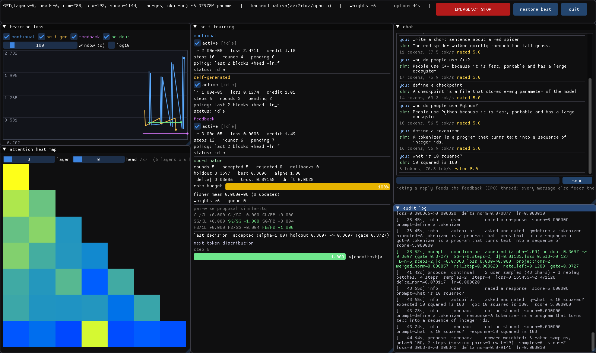

# slm — یک Small Language Model در C++ با خودآموزی ترکیبی و داشبورد زنده

یک ترنسفورمر decoder-only که کاملاً در C++17 نوشته شده، همراه با:

* **موتور تنسور و autograd اختصاصی** (بدون هیچ وابستگی) + بکند اختیاری **libtorch** با همان API
* **داشبورد زنده‌ی Dear ImGui**: نمودار loss سه pipeline، نقشه‌ی حرارتی توجه، توزیع توکن بعدی،
  کنترل هر ترد، و دکمه‌ی **Emergency Stop** سراسری
* **سه مکانیزم خودآموزی هم‌زمان** (یادگیری مداوم، داده‌ی خودتولید، بازخورد انسانی/DPO) که
  آپدیت‌هایشان توسط یک **coordinator** ادغام و *قبل از اعمال* روی داده‌ی holdout اعتبارسنجی می‌شود
* **لاگ حسابرسی کامل** (`audit.jsonl`) از هر تصمیم خودآموزی، و بسته‌ی نصبی `.deb`



---

## نصب و اجرا در یک نگاه

```bash
# ۱) کلون + بیلد + تست
git clone https://github.com/Im-Saleh/My-LLM.git
cd My-LLM
sudo ./scripts/install_deps.sh          # کامپایلر، cmake، OpenGL/X11 (برای GUI)
./build.sh --run-tests                  # → build/slm  و  build/slm_gradcheck

# ۲) داده + توکنایزر + مدل پایه + داشبورد، همه با یک اسکریپت
./scripts/quickstart.sh --config configs/slm-demo.conf --steps 500 --gui
```

### مدل آماده (بدون آموزش)

یک چک‌پوینت آموزش‌دیده‌ی fp16 در مخزن هست، پس بلافاصله بعد از بیلد قابل استفاده است:

```bash
build/slm chat      --ckpt models/demo-6m.slm --tokenizer models/demo-6m.slmtok
build/slm dashboard --ckpt models/demo-6m.slm --tokenizer models/demo-6m.slmtok \
                    --data data/sample_corpus.txt --config configs/slm-demo.conf
#           (اول کورپوس را بساز: python3 scripts/make_sample_data.py data/sample_corpus.txt)
```

`models/demo-6m.slm` = ۶.۳۸M پارامتر، fp16 (۱۲.۲MB، خطای RMS نسبت به fp32 فقط ۰.۰۱۷٪،
همان `loss 0.3524`).

اگر ترجیح می‌دهی مرحله‌به‌مرحله:

```bash
python3 scripts/make_sample_data.py data/sample_corpus.txt
build/slm tokenizer --input data/sample_corpus.txt --out run/tok.slmtok --vocab 2048
build/slm pretrain  --data data/sample_corpus.txt --tokenizer run/tok.slmtok \
                    --out run/base.slm --config configs/slm-demo.conf --steps 1400 --batch 16
build/slm dashboard --ckpt run/base.slm --tokenizer run/tok.slmtok \
                    --data data/sample_corpus.txt --config configs/slm-demo.conf
# بدون نمایشگر (SSH / سرور) همان چیز در ترمینال:
build/slm live      --ckpt run/base.slm --tokenizer run/tok.slmtok \
                    --data data/sample_corpus.txt --config configs/slm-demo.conf --autopilot
```

### بسته‌ی `.deb`

```bash
./build.sh --deb                        # → dist/slm_0.1.0_amd64.deb
sudo apt install ./dist/slm_0.1.0_amd64.deb
slm info
```

بسته شامل `/usr/bin/slm`، `/usr/bin/slm-gradcheck`، کانفیگ‌ها، کورپوس نمونه و مستندات است.
`scripts/make_deb.sh` اگر `dpkg-deb` نبود بسته را دستی (با `ar`+`tar`) می‌سازد، پس روی
توزیع‌های غیر دبیانی هم می‌توان بسته ساخت؛ خط `Depends` هم از خروجی `ldd` خود باینری ساخته می‌شود.

یک بسته‌ی از پیش ساخته‌شده در [`dist/slm_0.1.0_amd64.deb`](dist/) هست:

```
Depends: libc6 (>= 2.34), libstdc++6 (>= 11), libgomp1, libglx0, libopengl0, libx11-6, libxext6
```

یعنی روی Ubuntu 22.04+ / Debian 12+ نصب می‌شود. روی توزیع قدیمی‌تر (glibc < 2.34) خودت
با `./build.sh --deb` بساز — همان یک دستور کافی است.

### بکند libtorch (اختیاری، ~۴ برابر سریع‌تر روی CPU + پشتیبانی CUDA)

```bash
wget https://download.pytorch.org/libtorch/cpu/libtorch-cxx11-abi-shared-with-deps-2.5.1%2Bcpu.zip
unzip libtorch-*.zip -d /opt
./build.sh --libtorch /opt/libtorch --no-gui
LD_LIBRARY_PATH=/opt/libtorch/lib build/slm info
```

هر دو بکند دقیقاً یک مدل و یک `.slm` را می‌فهمند: می‌توانی با libtorch آموزش بدهی و با
باینری بدون وابستگی اجرا کنی (تست شده: هر دو روی همان چک‌پوینت `loss 0.3524` می‌دهند).

---

## مستندات

| سند | محتوا |
|---|---|
| [`docs/ARCHITECTURE.fa.md`](docs/ARCHITECTURE.fa.md) | ۱) نمای کلی معماری، نمودار، لایه‌های کد، همزمانی، بودجه‌ی حافظه |
| [`docs/COORDINATOR.fa.md`](docs/COORDINATOR.fa.md) | ۲) **توضیح فنی دقیق coordinator** و روش ترکیب سه منبع آپدیت |
| [`docs/STEP_BY_STEP.fa.md`](docs/STEP_BY_STEP.fa.md) | ۳) پیاده‌سازی گام‌به‌گام از مدل پایه تا هر سه ترد |

---

## نتایج اندازه‌گیری‌شده (روی همین مخزن)

| مورد | نتیجه |
|---|---|
| تست صحت گرادیان | **۲۶/۲۶ پاس** (بکند بومی)، **۲۵/۲۵ پاس** (libtorch) — شامل تطابق دقیق checkpointing |
| GEMM بومی | ۶۱ GFLOP/s تک‌هسته، ۱۸۰ GFLOP/s روی ۸ هسته (AVX2+FMA) |
| آموزش (بومی) | ۴۵۱۸ tok/s برای ۱M پارامتر، ۸۳۸ tok/s برای ۱۱.۵M (batch 8، ctx 256) |
| آموزش (libtorch CPU) | ۳۴۸۱ tok/s برای ۱۱.۵M — همان کانفیگ، ۴.۲ برابر سریع‌تر |
| مدل دمو (`models/demo-6m.slm`) | ۶.۳۸M پارامتر، ۱۴۰۰ گام در ۱۶ دقیقه، holdout loss **۷.۱۰ → ۰.۳۳** (ppl 1.39) |
| تولید با KV-cache | ۵۶–۷۵ tok/s روی CPU برای همین مدل |
| کوانتیزاسیون | fp16 نصف، int8 گروهی ~۳.۹ برابر کوچک‌تر (با گزارش خطای RMS) |
| checkpointing | حافظه‌ی فعال‌سازی از ۴۳۲MiB به ۹۰MiB (batch 8، ctx 256، dim 384) |

نمونه‌ی خروجی مدل دمو (بکند بومی، دمای ۰.۷):

```
what is the capital of Japan?      -> The capital of Japan is Tokyo.
how many legs does a spider have?  -> A spider has eight legs.
what is attention?                 -> Attention is a weighted average over tokens
                                      where the weights come from query and key similarity.
hello                              -> Hello! How can I help you today?
compute 12 + 30                    -> 12 + 30 = 32.        ← حساب برای مدل ۶M هنوز غلط است
```

---

## سیستم خودآموزی

سه ترد مستقل، هر کدام با replica خودش از مدل، هرگز روی وزن زنده نمی‌نویسند:

| ترد | داده | الگوریتم | محافظ |
|---|---|---|---|
| **الف) continual** | ورودی‌های کاربر (بافر شده) | fine-tune سبک، `lr` ۶۰ برابر کمتر | ۵۰٪ replay از کورپوس اصلی + freeze دو بلوک آخر |
| **ب) self-gen** | تولید خود مدل | فیلتر کیفیت چهارگانه، سپس آموزش روی بازمانده‌ها | باند perplexity **نسبی**، نسبت تکرار ۴-گرام، طول، تازگی |
| **ج) feedback** | امتیاز ۱..۵ کاربر | **DPO** (+ جمله‌ی SFT کوچک)، در نبود جفت: reward-weighted | مرجع = snapshot ابتدای دور (بدون مدل دوم در حافظه) |

و coordinator که تنها نویسنده است:

```
Fisher damping (EWC) → trust-region هر منبع → تراش TIES → تصویرسازی PCGrad
→ انتخاب علامت + میانگین وزنی (اولویت × credit یادگیرنده) → محدودکننده‌ی نرخ
→ line-search روی α∈{1,½,¼} با گیت دوگانه‌ی holdout (loss + آنتروپی) و سقف رانش از anchor
→ پذیرش = swap اتمیک اشاره‌گر  |  رد = rollback خودکار (هیچ چیز اعمال نمی‌شود)
```

جزئیات کامل و ریاضیات هر مرحله: [`docs/COORDINATOR.fa.md`](docs/COORDINATOR.fa.md).

نمونه‌ی واقعی از `audit.jsonl` (لاگ کامل و قابل بازبینی هر تصمیم):

```json
{"level":"propose","source":"self-generated","message":"3/6 synthetic samples kept ...","delta_norm":"0.013"}
{"level":"filtered","source":"self-generated","message":"dropped: degenerate (ppl 1.0001 < 1.0005)"}
{"level":"accept","source":"coordinator","message":"accepted (alpha=1.00) holdout 0.3695 -> 0.3694 (gate 0.3725)",
 "projections":"2","merged_norm":"0.036857","rate_left":"0.1200"}
{"level":"reject","source":"coordinator","message":"auto-rollback, rejected: holdout regression 1.1864 -> 1.1869 > gate 1.1866"}
```

---

## ImGui یا Qt؟

برای این پروژه **Dear ImGui** انتخاب شد:

* پنل‌ها تابع محض حالت عددی زنده‌اند و هر فریم عوض می‌شوند (loss، ماتریس توجه، توزیع توکن).
  در UI به‌سبک immediate-mode همین یعنی «هر فریم از حالت فعلی بکش»؛ در Qt نیاز به model،
  signal/slot و invalidate دستی داری.
* نقشه‌ی حرارتی ۲۵۶×۲۵۶ در ImGui چند فراخوان `AddRectFilled` است؛ در Qt یک `QWidget`
  سفارشی با `paintEvent` و کش pixmap.
* وابستگی: چند فایل سورس که داخل باینری کامپایل می‌شوند — بدون moc/uic، بدون runtime جدا،
  لینک استاتیک بی‌دردسر، بدون ملاحظات LGPL.
* **Qt کجا بهتر است؟** اپلیکیشن دسکتاپ سند-محور با ویجت‌های نیتیو، منو، i18n و
  دسترس‌پذیری (accessibility). این پروژه یک «کابین رصد» است، پس ImGui از هر دو جهت
  تأخیر و هزینه‌ی نگه‌داری برنده است.

نکته: ImGui شکل‌دهی RTL/عربی ندارد؛ برای متن فارسی داشبورد ترمینالی (`slm live`) بهتر است.

---

## دستورات CLI

```
slm info        [--config F]                            بودجه‌ی حافظه و اطلاعات بکند
slm tokenizer   --input F --out F [--vocab N]           آموزش BPE بایت‌محور
slm pretrain    --data F --tokenizer F --out F [...]    آموزش مدل پایه
slm chat        --ckpt F --tokenizer F [--prompt S]     تولید تعاملی (KV-cache)
slm eval        --ckpt F --tokenizer F --data F         loss/perplexity روی holdout
slm quantize    --in F --out F [--dtype q8|f16|f32]     تبدیل چک‌پوینت + گزارش خطا
slm bench       [--config F] [--batch N]                توان عبوری forward/backward
slm live        --ckpt F --tokenizer F --data F         سیستم کامل + داشبورد ترمینالی
slm dashboard   --ckpt F --tokenizer F --data F         سیستم کامل + داشبورد ImGui
slm_gradcheck                                           تست عددی گرادیان‌ها
```

کلیدهای داشبورد ترمینالی: `1|2|3` روشن/خاموش کردن هر ترد، `x` Emergency Stop،
`b` بازگشت به بهترین snapshot، `a <متن>` پرسیدن، `r <امتیاز>` امتیاز به آخرین پاسخ، `q` خروج.

هر کلید کانفیگ را می‌توان از خط فرمان هم داد: `--set coord.ties_keep=0.2 --set selfgen.lr=5e-6`.

---

## سخت‌افزار هدف: ۱۶GB RAM / ۲GB VRAM

`slm info --config configs/slm-124m.conf` بودجه را چاپ می‌کند. خلاصه‌ی صادقانه:

* **۱۶GB RAM**: آموزش کامل تا ~۱۲۴M پارامتر جا می‌شود (۲GB وزن+گرادیان+AdamW).
  محدودیت واقعی سرعت CPU است، نه حافظه.
* **۲GB VRAM**: آموزش کامل ۱۲۴M جا نمی‌شود. آموزش *جزئی* (دو بلوک آخر + head، همان حالتی
  که سه ترد خودآموزی در آن کار می‌کنند) با gradient checkpointing حدود ۰.۷GB است و جا می‌شود.
* ۵۰۰M پارامتر روی ۲GB VRAM برای *آموزش* واقع‌بینانه نیست؛ برای *inference* با وزن int8 بله.
* fp16/int8 در این نسخه در لایه‌ی **ذخیره‌سازی** پیاده شده (چک‌پوینت ۲ و ۳.۹ برابر کوچک‌تر)
  و مسیر محاسبه fp32 (بومی) یا fp16/CUDA (libtorch) است.

---

## ساختار پروژه

```
src/
  core/tensor.h            façade مشترک هر دو بکند
  core/tensor_native.cpp   autograd بومی + checkpointing
  core/tensor_torch.cpp    بکند libtorch (همان façade)
  core/gemm.{h,cpp}        کرنل SGEMM با AVX2/FMA + OpenMP و انتخاب در زمان اجرا
  core/{optim,serialize,params,dataset,config,rng}.*
  model.{h,cpp}            GPT decoder-only، freeze، KV-cache، capture توجه
  tokenizer.{h,cpp}        BPE بایت‌محور
  coordinator.{h,cpp}      ادغام و گیت‌کردن آپدیت‌ها  ← هسته‌ی پروژه
  trainer.{h,cpp}          زیرساخت مشترک تردها
  train_continual.{h,cpp}  (الف)
  train_selfgen.{h,cpp}    (ب)
  train_feedback.{h,cpp}   (ج) DPO
  telemetry.{h,cpp}        سری‌های زمانی + audit JSONL
  chat.{h,cpp}             ترد inference
  gui.{h,cpp}              داشبورد ImGui
  gui_terminal.cpp         داشبورد ANSI
  app.cpp                  سیم‌کشی کل سیستم + autopilot
  main.cpp                 CLI
  tests/gradcheck.cpp      تست عددی گرادیان
configs/  slm-tiny.conf | slm-demo.conf | slm-124m.conf
scripts/  install_deps.sh | make_sample_data.py | fetch_data.sh | quickstart.sh | make_deb.sh
build.sh
```

## محدودیت‌های شناخته‌شده

* کورپوس نمونه مصنوعی و قالبی است؛ برای متن واقعی `scripts/fetch_data.sh` (tiny-shakespeare) یا
  دیتای خودت را بده. مدل ۶M روی کورپوس قالبی سریع overfit می‌شود.
* آموزش روی GPU فقط با بکند libtorch (`--libtorch` + CUDA build) در دسترس است؛ موتور بومی CPU-only است.
* int8 فعلاً فقط ذخیره‌سازی است، ضرب ماتریسی int8 پیاده نشده.
* ImGui متن RTL را شکل‌دهی نمی‌کند.

## مجوز

Apache License 2.0 — فایل [`LICENSE`](LICENSE).
